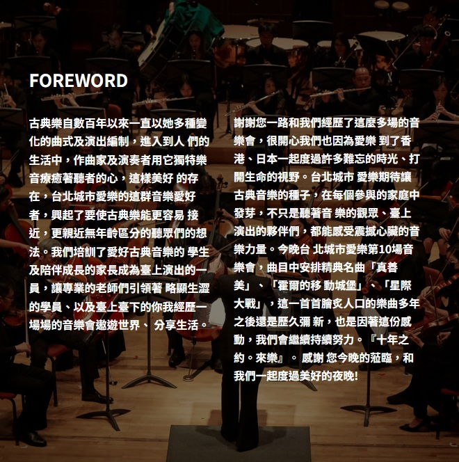
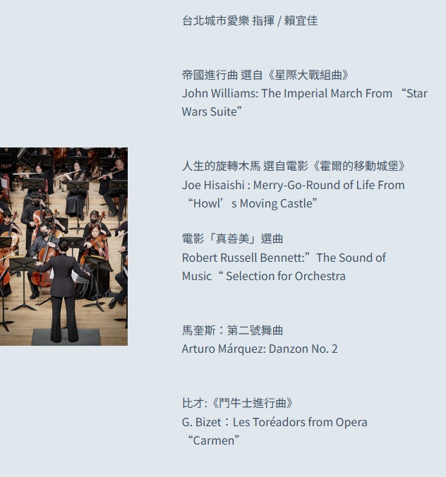

import { YouTube, LinkPreview } from "astro-embed";
import "@splidejs/splide/css";
import { Splide, SplideSlide } from "astro-splide";

**十年之約。來樂**

<Splide
  class='not-content'
  options={ {  // check for options at https://splidejs.com/guides/options/
    type: 'loop',         // type of the carousel
    autoplay: true,       // activate autoplay
    interval: 2000,       // autoplay interval in milliseconds
    pauseOnHover: false,  // do not pause autoplay on mouseover
  } }
>

  <SplideSlide>    </SplideSlide>
  <SplideSlide>    </SplideSlide>
  <SplideSlide>    </SplideSlide>
  <SplideSlide>    </SplideSlide>
  <SplideSlide>    </SplideSlide>
  <SplideSlide>    </SplideSlide>
  <SplideSlide>    </SplideSlide>
  <SplideSlide>    </SplideSlide>
  <SplideSlide>    </SplideSlide>
  <SplideSlide>    </SplideSlide>
  
</Splide>

 

<YouTube id="https://youtu.be/4FcGtghEnt8" />
