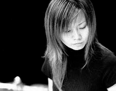

> 回國後任教於東吳大學，臺中教育大學，東海大學及嘉義大學音樂系及研究所，擔任個別課，擊樂專題研究，及擊樂團等課程之指導教授。同時並任教於台中教育大學附設實驗小學打擊樂團及中部國高中音樂班。指導的主修學生於國內外比賽及考試皆有優異成績。

**孫名箴**

Ming-Jen Suen/打擊樂家

留美打擊樂家孫名箴，臺中市人，北德克薩斯州大學打擊樂博士(D.M.A., University of North Texas)，師事 Mark Ford、 Christopher Deane、Ed Soph、Robert Schietroma、Ed Smith 等教授，曾獲學業傑出成就獎、音樂院院長特別獎及全美打擊樂協會(Percussion Arts Society)所頒發的傑出人才獎。

留美期間演出活躍，除校內演出外，積極參與各音樂節的演出，包括達拉斯新音樂節、全美音樂教師年會、全美打擊樂協會年會、及法國打擊樂節等，並與北德克薩斯州大學絃樂團演出 Eric Ewazen 作品 The Concerto for Marimba and String Ensemble。演出足跡遍佈美國、加拿大、比利時、盧森堡、法國等國家。

回國後重要演出記事有「落葉‧傾 城‧張愛玲」，第八屆台北國際打擊樂節、亞青樂集第五屆「擊舞」打擊二重奏音樂會，高雄現代擊樂節，新點子樂展「變數遊樂園」等，除了現代及室內樂作品外，亦為國臺交常任客席團員。除了教學及演出外，也經常性擔任全國音樂比賽，術科大考的評審與國家歌劇院的評鑑委員。

回國後任教於東吳大學，臺中教育大學，東海大學及嘉義大學音樂系及研究所，擔任個別課，擊樂專題研究，及擊樂團等課程之指導教授。同時並任教於台中教育大學附設實驗小學打擊樂團及中部國高中音樂班。指導的主修學生於國內外比賽及考試皆有優異成績。
