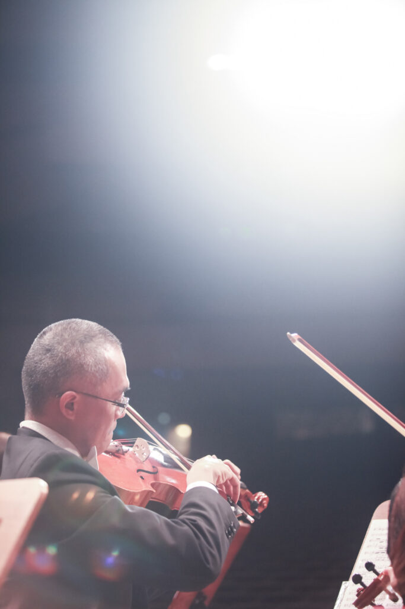

import "@splidejs/splide/css";
import { Splide, SplideSlide } from "astro-splide";
import MdxImage from "@components/MdxImage/MdxImage.astro";
import MdxEmbed from "@components/MdxImage/MdxEmbed.astro";

**樂動。琴聲揚**

> 臺中,是之瑀、泰和與我兒時的第一個舞臺、啟蒙了我們的音樂之路。
>
> 這一路對於音樂的堅持,讓我們今天有機會把耕耘多年的音樂苗圃中的種子部隊,
>
> 帶回到這最初始的舞台及家鄉,除了感謝師長們與好友們的支持,
>
> 也重溫我們曾經擁有許多豐富美好的童年回憶。
>
> 如同泰戈爾所說:『生命因為世界才發現自己的豐饒,卻從愛中得到存在的意義。』
>
> 我們因愛樂集結,因感動而持續努力。
>
> 再次感謝今晚您的蒞臨,和我們一起感受音樂的美好!
>
> **\-** 台北城市愛樂 賴宜佳

**曲目**

G. Holst : St. Paul's Suite, Mov. I 、III 、IV  
霍爾斯特:《聖保羅組曲》

Alan Menken : Beauty and the Beast Overture  
亞倫.孟肯:《美女與野獸序曲》

Henryk Wieniawski : Polonaise de concert, Op.4  
維尼奧夫斯基:《音樂會波蘭舞曲》  
小提琴歐之瑀

John Williams : Schindler s List Theme  
約翰.威廉斯:《辛德勒名單》主題  
中提琴|李泰和

Carlos Gardel : Por Una Cabeza  
卡洛斯·葛戴爾:探戈《一步之遙》  
小提琴I歐之瑀 中提琴|李泰和

Tchaikovsky : Polonaise from "Eugene Onegin"  
柴科夫斯基:〈波蘭舞曲〉自《尤金奧涅金》

Haydn : Trumpet Concerto in E-flat major, 2nd and 3rd Mov.  
海頓:《小號協奏曲》  
小號|侯傳安

Rimsky-Korsakov : Flight of the Bumblebee  
林姆斯基高沙可夫:《大黃蜂的飛行》  
小號|侯傳安

Khachaturian : Waltz from "Masquerade"  
哈察都量:〈圓舞曲〉選自《假面舞會》

John Williams : The Raiders March  
約翰·威廉斯:《法櫃奇兵進行曲》

Arturo Marquez : Conga del Fuego Nuevo  
《馬茲:新火康加舞曲》

<Splide
class="not-content"
options={{
		// check for options at https://splidejs.com/guides/options/
		type: "loop", // type of the carousel
		autoplay: true, // activate autoplay
		interval: 2000, // autoplay interval in milliseconds
		pauseOnHover: false, // do not pause autoplay on mouseover
	}}

>

    <SplideSlide>
    	{" "}
    	<MdxImage src="/images/pianomelody/IMG_8733-1.jpg" alt="" />{" "}
    </SplideSlide>
    <SplideSlide>
    	{" "}
    	<MdxImage src="/images/pianomelody/IMG_8774-1.jpg" alt="" />{" "}
    </SplideSlide>
    <SplideSlide>
    	{" "}
    	<MdxImage src="/images/pianomelody/IMG_8866-1.jpg" alt="" />{" "}
    </SplideSlide>
    <SplideSlide>
    	{" "}
    	<MdxImage src="/images/pianomelody/IMG_8999-1.jpg" alt="" />{" "}
    </SplideSlide>
    <SplideSlide>
    	{" "}
    	<MdxImage src="/images/pianomelody/IMG_9295-1.jpg" alt="" />{" "}
    </SplideSlide>
    <SplideSlide>
    	{" "}
    	<MdxImage src="/images/pianomelody/P7050197-2.jpg" alt="" />{" "}
    </SplideSlide>
    <SplideSlide>
    	{" "}
    	<MdxImage src="/images/pianomelody/P7050354-1.jpg" alt="" />{" "}
    </SplideSlide>
    <SplideSlide>
    	{" "}
    	<MdxImage src="/images/pianomelody/P7050363-1.jpg" alt="" />{" "}
    </SplideSlide>
    <SplideSlide>
    	{" "}
    	<MdxImage src="/images/pianomelody/P7050429-1.jpg" alt="" />{" "}
    </SplideSlide>
    <SplideSlide>
    	{" "}
    	<MdxImage src="/images/pianomelody/P7050534-1.jpg" alt="" />{" "}
    </SplideSlide>

</Splide>

<MdxEmbed src="/images/pianomelody/2023pianomelody.pdf" type="application/pdf" ratio={0.7048} />
