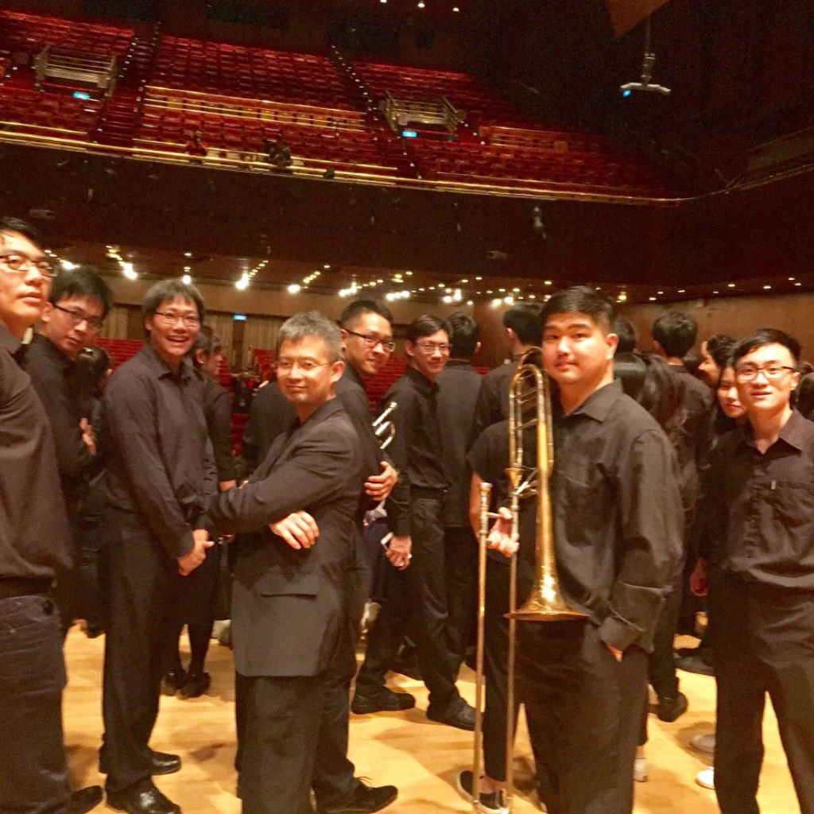
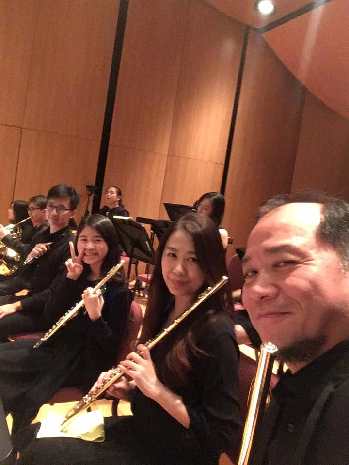
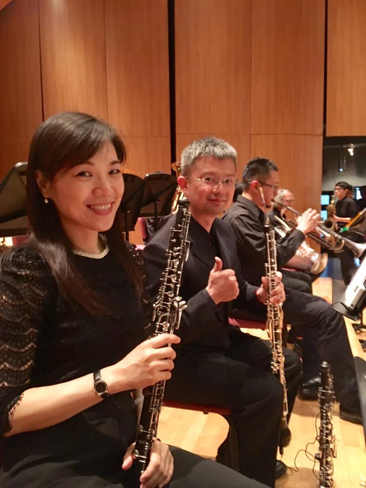
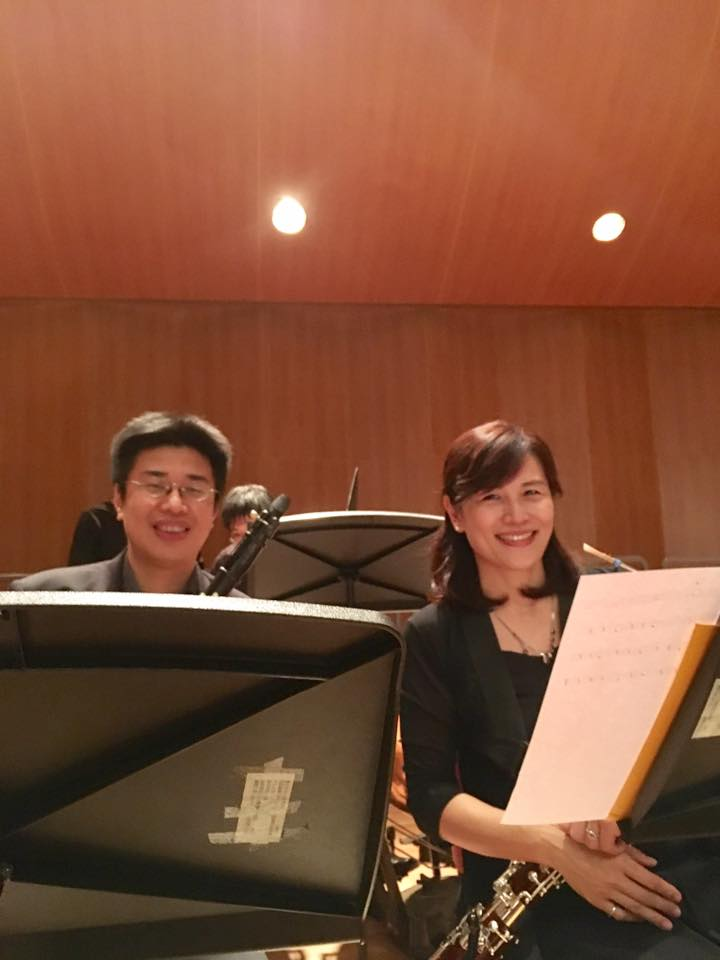
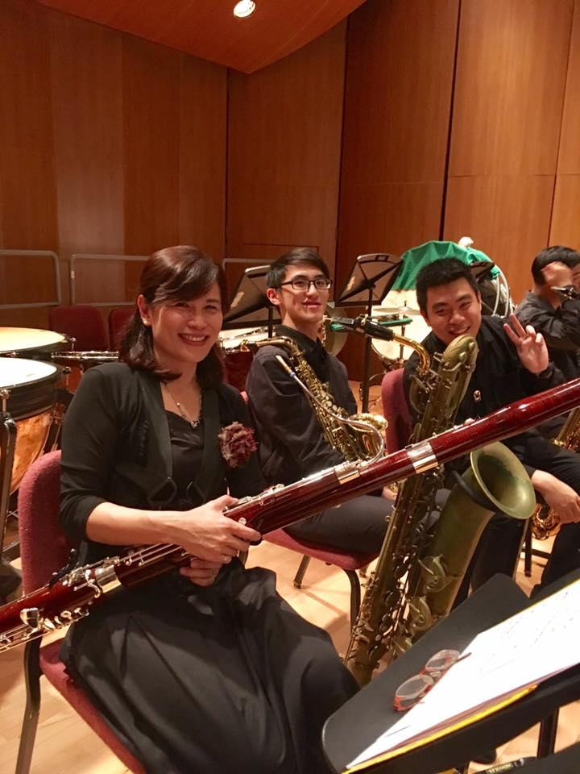
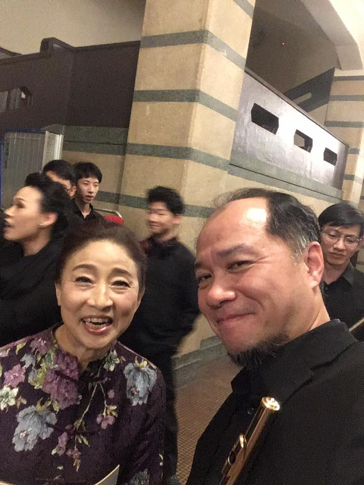

音樂是最好的心靈靈藥，也是最具撫慰精神效力的處方簽。我們積極推廣讓社區社群一起輕鬆玩古典樂，也希望能將這份熱情，帶給身邊需要更多關懷的朋友們，一種不需多說的溫暖陪伴，讓關懷彼此的心意，隨著樂音，深深走進乾涸的心靈中！

謝謝大家的支持，台北城市愛樂，第七年的莫斯科之夜，  
我們，玩的超開心!!

**琴戀莫斯科節目手冊**

<embed
src="/images/qinlian-moscow/Mosco-190501.pdf"
type="application/pdf"
width="100%"
height="400"

> </embed>

- [琴戀。莫斯科](#琴戀莫斯科)
- [讓生活豐富](#讓生活豐富)
- [讓生命美好](#讓生命美好)
- [讓人心感動](#讓人心感動)
- [讓音樂成為人生中的最佳陪伴](#讓音樂成為人生中的最佳陪伴)
- [民權國小弦樂團](#民權國小弦樂團)
- [簡介 Introduction](#簡介-introduction)
- [弦樂 A 團](#弦樂-a-團)
- [第一小提琴：](#第一小提琴)
- [第二小提琴：](#第二小提琴)
- [中提琴：](#中提琴)
- [大提琴：](#大提琴)
- [低音提琴：](#低音提琴)
- [弦樂 B 團](#弦樂-b-團)
- [小提琴：](#小提琴)
- [中提琴：](#中提琴-1)
- [大提琴：](#大提琴-1)
- [感謝優秀的弦樂團教師群](#感謝優秀的弦樂團教師群)
- [弦樂 C 團](#弦樂-c-團)
- [小提琴：](#小提琴-1)
- [中提琴：](#中提琴-2)
- [大提琴：](#大提琴-2)
- [低音提琴：](#低音提琴-1)
- [民權國小弦樂團](#民權國小弦樂團-1)
- [√ 演出曲目 PROGRAM](#-演出曲目-program)
- [1. 康康舞曲](#1-康康舞曲)
- [2. 貝多芬第 9 號主題](#2-貝多芬第-9-號主題)
- [3. 木屐舞曲](#3-木屐舞曲)
- [4. 威廉泰爾序曲](#4-威廉泰爾序曲)
- [5. 密西西比步態舞](#5-密西西比步態舞)
- [1. 中庸的快板](#1-中庸的快板)
- [2.「羅莎蒙」主題](#2羅莎蒙主題)
- [3. 英國民謠組曲](#3-英國民謠組曲)
- [4. 步態舞](#4-步態舞)
- [台北城市愛樂](#台北城市愛樂)
- [2019 琴戀。莫斯科](#2019-琴戀莫斯科)
- [台北城市愛樂簡介](#台北城市愛樂簡介)
- [簡介 Introduction](#簡介-introduction-1)
- [客席指揮 / 許澀心](#客席指揮--許澀心)
- [我們因有共同夢想而偉大，我們因有您的支持而在舞台上發光 有您，真好！](#我們因有共同夢想而偉大我們因有您的支持而在舞台上發光-有您真好)
- [伍德中醫診所](#伍德中醫診所)
- [A](#a)
- [年代提琴](#年代提琴)
- [台北店](#台北店)
- [■ 嘉義店](#-嘉義店)

# 琴戀。莫斯科

# 讓生活豐富

# 讓生命美好

# 讓人心感動

一民權國小校長 劉益麟

本校創立各類音樂社團自70年代起延續至今（合唱團成立於民國60年、國樂團成立於民國67年、管樂團成立於民國81年、直笛團成立於民國87年、弦樂團成立於民國87年），五大音樂團隊的發展和經營，深耕有成，對外參賽及展演表現精彩亮麗，從家長、校友、老師和孩子口中，充滿讚許、喜樂、甜美，留下許多美好的故事和回憶，各方予以肯定，佳話不斷。

我看見老師的承擔，看見老師的用心，也看見團隊中默默投入協助比賽及展演準備工作的家長，有不少的家長，孩子都畢業很久，繼續留下來幫忙，只因為看見老師長期付出與用心，因感謝感動而來。想當然，我也感動，感動的是，老師為孩子安排許多舞台，透過一次次的展演，建立自信，這無盡付出的辛苦，已超過本職工作的承擔，更甚，喜樂承載民權音樂教育傳統及特色延續的使命。

本著為孩子打造美好回憶，希望民權的孩子在學校生活中，能聽到歌聲、樂聲、讀書聲、跑步聲，聲聲縈繞校園，這畫面能伴隨孩子一生，在記憶裡留下片片美好。

民權的傳統將精彩延續，為音樂深耕民權，我們願意全力以赴。歡迎大家記得要參與一年一度音樂盛會，記得給孩子的表現拍拍手，記得給老師的付出大聲說讚，希盼愛音樂的家長給自己對本校音樂團隊的支持與愛，給一個大「心」！誠摯感謝所有的人，為民權音樂無盡地付出與支持！

# 讓音樂成為人生中的最佳陪伴

一民權國小家長會長 陳俊超

我的三個孩子都參加民權弦樂團，八年來陪著三個小孩團練、比賽、表演，甚至出國交流，大家都以為我打算把他們栽培成音樂家，其實我從沒這樣想過，單純的只是希望他們能夠把琴練好，只要有機會，隨時可以拉拉琴，藉著音樂與人分享、自娛娛人。

我也知道，學琴這件事跟學打籃球或學游泳不同，大部分的人學了一點籃球技巧或游泳技巧，即使再也沒有花時間練習，偶爾還是會去打打籃球、游游泳；但有很多學琴的人停止了學習之後，就再也沒碰過琴，更別說要完整的演奏一段曲子跟人分享，最主要的關鍵在於當年學琴時是否奠定了基礎，有了基本程度才有能力演奏想表現的曲子。而建立基礎的最佳時期就是小學階段，課業壓力不大、時間充裕、學習力強的小學生只要願意，小學階段就可以具備基礎的琴藝，可以自娛娛人了。三個孩子也因為一起學琴，開玩笑的自稱是”三隻小豬大樂團”，還跑去別人的求婚場子伴奏，成為他們難忘的一段回憶。

民權弦樂團的孩子很幸福，四年的基礎養成教育，不僅具備大樂團、小型室內樂的合奏能力，也有協奏曲的獨奏機會，加上許多的比賽、表演經驗，能夠從容地把美好的音樂帶給大家。雖然學習的過程還是會有些辛苦，但是抬頭看一下台上的孩子們，你會發現一切是值得的，因為你會看到孩子帶著自信的神情站上舞台，用音樂跟大家分享，得到在場所有人的掌聲。

而且，畢業後不論念哪所國中，仍可以回到民權，在台北城市愛樂樂團中與老師、學長姐學弟妹甚至家人們一起練琴、一起演出，繼續著與音樂的情誼，享受音樂的美好。人生多了音樂的陪伴，生活會更加精采。

# 民權國小弦樂團

# 簡介 Introduction

民權國小弦樂團成立於民國87年9月，這些年來感謝劉益麟校長、紀清珍校長、曾文錄校長、吳國基校長以及各處室主任的大力支持、級任老師的配合、家長們的協助，使得樂團才能有今天的規模與成績。

賴宜佳老師為現任負責老師，加上專業的外聘老師團隊，以培養孩子樂器演奏的能力，增進美感的學習與自我能力的啟發為目標。為增進孩子們的音樂視野，另與管樂團部份學生組成管弦樂團，屢次在音樂比賽中獲得優異的成績、團員們熱心參與各項活動，曾應臺北市文化局之邀參加「兒童音樂嘉年華」活動於市政府廣場表演、「嘉義弦樂節」演出以及擔任「市長獎頒獎典禮」大會樂隊；我們也很開心能在空軍聯隊端午節活動、松山機場報佳音、松山長老教會社區藝文音樂會、臺安醫院聖誕節點燈活動等社區活動中參與演出。

但願本團能獲得家長與社會大衆的迴響，希望藉著美的樂聲喚起大家對音樂的喜好與欣賞，促使人人愛樂的意念，從培養學生的美感經驗，進而變化社會風氣。

# 弦樂 A 團

# 第一小提琴：

黃倚恩、郭宥辰、陳妍伶、林得欣、簡聖諺、葉宗翰、陳柏丞、張凱雯、王奕翔、韋凱翔、李承佑、楊恩伶、謝牧言、羅竣薰

# 第二小提琴：

王楚元、賴弈鈞、王靖颺、張芙靜、李亞儒、向唯嘉、王宥棋、陳熙、林珮嘉、林徹、王媛伶、王媛俐、黃柏諺、李柏儒、林昱辰、梁凱程、陳禾榛、陳樂妍

# 中提琴：

陳麒宇、葉宗澔、黃秉洋、吳孟蓁、陳樂齊

# 大提琴：

王琦萱、劉青懷、黃可薰、宋恩澤、鄭郁蒼、陳牧言、廖品淳、文詠晴

# 低音提琴：

何禹均

# 弦樂 B 團

# 小提琴：

張廷肇、李晨瑜、陳昱瑞、林筠芸、田馥瑄、趙梓甯、吳嘉瑜、王宏盛、陳昀萱、董又實、楊昕展、黃昱婉、王新力

# 中提琴：

林彥呈、傅苡涵、周庭雋

# 大提琴：

林品睿、洪子涵

# 感謝優秀的弦樂團教師群

小提琴：黃耀德、王博仁、吳偉倫、陳亮妃、黃如宜、王玟彤 老師

中提琴：謝君宜、李泰和、張菀真 老師

# 弦樂 C 團

# 小提琴：

林佑勳、黃惠榆、楊之沂、羅芊涵、郭姿琦、歐陽宥辰、曾資涵、林沅東、郭晁霆、車劭騏、童語

# 中提琴：

呂宥霖、劉元泰、黃稚淳

# 大提琴：

劉宥廷、淺田燦、溫新予、陳莘亞

# 低音提琴：

王巳昱、王榕昇、林宬緯

# 民權國小弦樂團

# √ 演出曲目 PROGRAM

C 團 | 指揮：李泰和 老師

# 1. 康康舞曲

Can-Can

# 2. 貝多芬第 9 號主題

Beethoven's Ninth

# 3. 木屐舞曲

Clog Dance

# 4. 威廉泰爾序曲

William Tell Overture

# 5. 密西西比步態舞

Mississippi Cakewalk

B 團 | 指揮：謝君宜 老師

# 1. 中庸的快板

J. S. Bach : Allegro moderato

# 2.「羅莎蒙」主題

F. Schubert : Rosamunde

# 3. 英國民謠組曲

Brittanic Tryptich

# 4. 步態舞

Norman Leyden :

Cakewalk From Serenade For String Orchestra

A 團 | 指揮：黃耀德老師

1. D 大調協奏曲 作品 121

A. Vivaldi : Concerto for Strings in D major, RV 121

2. 韋瓦第四部小提琴協奏曲 第一樂章

A. Vivaldi : Violin Concerto for 4 violins op. 3 n° 10,1st Mov.

3. 卡普濟低音提琴協奏曲 第三樂章

A. Capuzzi : Double Bass Concerto, 3rd Mov.

4. 中提琴 c 小調協奏曲 第一樂章

J. C. Bach: Viola Concerto in C Minor, 1st Mov.

5. 熱情的快板

Saint-Saëns: Allegro Appassionato, Op.43

6. 威廉泰爾序曲

William Tell Overture

中場休息 Intermission

# 台北城市愛樂

1. 中亞細亞草原

A.Borodin : In the Steppes of Central Asia

2. 圓舞曲 選自「睡美人」

P. I. Tchaikovsky : Waltz, from "Sleeping Beauty", Op.66

3. 第二號圓舞曲

D. Shostakovich : Waltz No.2 From The Jazz Suite No.2

4. 斯拉夫進行曲

P. I. Tchaikovsky : Marche Slave Op. 31

5. 曼波 選自「西城故事」

L. Bernstein : Mambo from West Side Story

# 2019 琴戀。莫斯科

十九世紀中葉以後民族主義興起，民族意識相繼覺醒，這個潮流影響所及，歐洲各國的作曲家們紛紛往自己民族的傳統素材中找尋作曲的靈感。

一時之間，富有各民族獨特色彩的音樂，如雨後春筍般在各地出現，二十世紀初俄國十月社會主義革命勝利後，俄羅斯音樂更是進入了新的發展階段，這些所譜寫的音樂因都具有民族特色，形成了所謂的「國民樂派」，使得浪漫樂派時期音樂更加絢爛美麗。

國民樂派五人組之一的作曲家鮑羅定在樂譜上寫下了這樣的說明：在一望無際的中亞草原上，隱隱傳來俄羅斯歌曲。馬匹和駱駝的腳步聲由遠至近，之後又響起了古老憂鬱的東方歌曲。一支商隊在俄羅斯士兵的護送下穿越廣闊的草原從遠遠的地方走來，然後又慢慢遠去。俄羅斯歌曲和古老的東方歌曲融合，在草原上形成和諧的迴音。最後，在草原上空逐漸消失。

下半場以這首交響詩拉開序幕，整曲以簡單的歌謠旋律編串而成，描述俄羅斯人與亞洲人，在高加索的草原上互動的情形。

擁有「旋律之王」美名的柴可夫斯基，十九世紀偉大的作曲家，也是俄羅斯國民樂派的代表人物。

他的作品反映了沙皇專制統治下的俄國廣大知識階層的苦悶心理和對幸福美滿生活的深切渴望，著力揭示人們的內心矛盾，充滿強烈的戲劇衝突和熾熱的感情色彩。

芭蕾舞雖起源於義大利，但真正發揚光大的是在俄國，柴可夫斯基擅長寫作芭蕾舞音樂，在電影《黑魔女：沉睡魔咒》Maleficent中黑暗、鬱悶風格的主題曲，其實是柴可夫斯基的經典《睡美人》中的圓舞曲所改編，今晚呈現的是獨樹一格、辨識性極高的亮麗璀璨風格原曲。

《斯拉夫進行曲》熱情奔放，極具俄韻風味。樂曲分為三個部分：開頭為沉重的氣氛描寫出奧斯曼帝國對塞爾維亞的壓迫，民衆苦不堪言，對抗強權獨立建國是唯一出路；第二部分氣氛較為輕快，但仍處於劣勢，當俄國舞曲的旋律出現時，代表俄羅斯向塞爾維亞的人民伸出援手；第三部分轉調後曲風變得更明朗，有如勝利慶典的氣氛一樣，樂團將樂曲推往最終高潮，最後勝利絢爛的結束。

愛國的作曲家蕭士塔高維奇，他的命運與創作伴隨著蘇聯專制詭譎的政治起起伏伏，曾兩度遭受蘇共譴責與查禁，但也曾受頒「最高蘇維埃」的國家榮譽。他在音樂創作上的才華與表現，並不受這些紛擾的政治所影響，一向嚴肅沉悶的蕭士塔高維奇，寫出了膾炙人口的《爵士組曲》，當中的《第二號圓舞曲》雖然短小但配器豐富，旋律簡單而具親和力，其透露出歡樂、愉快的樂觀主義情感，有一種不可抗拒的吸引力和動人心弦的渲染力，在欣賞的同時也讓我們見證了藝術家們在面對外在環境壓力下，甚至在灰暗的時代，他們的音樂作品依然閃耀著永不熄滅的光輝。

指揮／李泰和 Lee Tai-Ho

自幼習樂的李泰和五歲學習鋼琴，六歲開始接觸小提琴，十歲就讀音樂班深深為中提琴富變化的淳厚音色所吸引，主修中提琴在校期間表現屢獲獎，資賦優異以第一名之成績甄試保送輔仁大學音樂系。曾師承趙永男老師、黃文慶老師、潘輝皓老師、林文也老師、姚元教授、何君恆教授等。2003年赴法國巴黎深造，以第一名成績獲得RUEIL-MALMAISON音樂院高級演奏家文憑、傑出演奏家文憑、評審並以一致通過給與最優異成績畢業。除自我對演奏有衷情的執著，不定期舉辦個人獨奏會外，對台灣音樂教育環境的營造亦不遺餘力，現為臺灣室內樂藝術推廣協會會員，並任教於基隆高級中學音樂班、培德高中音樂班、中平國中音樂班、成功國小音樂班，民權國小、汐止國小、榮富國小、石牌國小，中小提琴分部指導老師。

輔仁大學音樂系畢業主修中提琴，在校期間曾隨郭聯昌、陳廷輝，張正木教授們帶領台灣樂藝管弦樂團赴馬新巡迴演出。2003年帶領明湖國中弦樂團參加內湖音樂嘉年華會於國防醫學院致德堂演出，2005-2009年為臺中市交響樂團、圓滿室內樂團中提琴手。亦隨中市府團隊赴美亞特蘭大、舊金山、馬邵爾群島、港澳等地為城市交流演出。目前於民權國小、碧湖國小、汐止國小、麗湖國小弦樂團合奏、分部個別指導教師。

指揮／謝君宜 Hsieh Chun-I

輔仁大學音樂系畢業，主修小提琴，1995年任職於國家音樂聽交響樂團1996-2001年赴香港、澳門、新加坡、馬來西亞、澳洲、紐西蘭等地演出。2002年參與畫家劉其偉「緣起玉山」音樂會、2003年總統府二二八紀念音樂會、2004年牽手護臺灣音樂會、2005年Mulophier莫拉非耳「顛覆前衛」音樂會、2007年阿里山曙光音樂會。近年來除了演出外，也致力於音樂推廣教育，並被多位音樂教育學者喻為「優秀的啟蒙教師」，目前任教於臺北市民權國小、汐止國小、大安國中弦樂團。

指揮／黃耀德 Huang Yao-Te

指揮／賴宜佳 Lai Yi-Chia

國立台灣師範大學音樂碩士。自幼習琴，從小進入音樂班就讀即展現音樂天分。熱衷參與樂團演出，多次受邀至國家音樂廳、國家戲劇院、各縣市文化中心參與演出。在學習音樂之路穩紮穩打，有著深厚的基礎，曾獲選參與臺灣青少年交響樂團至歐洲巡迴演出，足跡踏遍奧地利、法國、匈牙利等國際級音樂廳，也受邀至總統府介壽音樂會參與演出。第一名進入台灣師大音樂研究所指揮組，之後多次與師範大學管弦樂團合作演出，並獲邀指揮新銳作曲家之作品發表。熱於學習的她在忙碌的工作之虞不忘學習，參加美國參加巴德大學參加指揮音樂節，受Harold Farbermann、Apo Hsu、Raymond Harvey等指揮家指導。每次音樂會在舞台上展現的指揮魅力與熱情，除在樂曲表現豐沛的生命力外，其豐富迷人的肢體語言與表情對音樂的詮釋細膩，引領台下的每一位觀眾沈浸在音樂之中。對音樂與美感教育的培育與推動始終充滿活力，創立台北城市愛樂，希望藉由樂音與群眾作美的交流，豐富民眾的藝術生活，傳送人人愛樂的理念。

# 台北城市愛樂簡介

# 簡介 Introduction

台北城市愛樂成立於 2013 年，創團賴宜佳老師鑒於弦樂的多樣化演出，能激起更多愛樂民衆的迴響，因此邀約了弦樂王博仁老師、管樂知名指揮老師陳一夫老師及民生社區管樂團指揮尤金順老師情義協演，全力推廣更具有音樂教育的特別意義與功能的演出活動，2013 年 6 月第一次在中山堂中正廳演出，即得到熱烈的迴響，之後每年在中山堂定期舉辦音樂會，並受邀西華飯店、寶麗廣場聖誕活動演出。

有這麼一群老師，他們從臺灣各地聚集在臺北這座喧鬧的城市中，努力用音樂中的真、善、美來教育我們的下一代。2014年9月第一次在市政府親子劇場舉辦大提琴重奏音樂會，結集小小孩與老師群所編製出的50人大提琴團，首次演出即獲得大衆熱烈的回應，並應邀參與至Bellavita寶麗廣場聖誕活動、SOGO復興館的社區藝文活動演出。

2016年1月及2017年2月更赴香港、大阪，在香港理工大學、伊丹市立文化會館作交流演出，今年夏天城市愛樂的年輕學子們將至日本參加富士山河口湖音樂祭，於國際青少年交流音樂會演出。我們期盼以音樂來減輕生活上的壓力，用樂曲來豐富枯涸的心靈，邀請這城市的人們一起沉浸在美妙的旋律裡！

# 客席指揮 / 許澀心

她能從指揮臺上將她的魄力，傳達給樂團及聽衆！—奧瑞岡日報

許靜心出生於臺灣基隆，七歲時由許子義老師啟蒙，開始接受音樂教育，並畢業於基隆仁愛國小，爾後於新北市板橋光仁中學及國立臺灣師範大學音樂系主修鋼琴，副修聲樂及低音提琴。完成低音提琴碩士學位後，則跟隨 Charles Bruck 專攻指揮藝術，並進而取得指揮藝術家文憑。

1990 年，經由美國交響樂團聯盟甄選推薦，開始與路易維爾交響樂團合作，並參與作曲家 Joan Tower 作品〈美國杉〉的演出計畫。1991 年，她接受奧瑞岡交響樂團聘任，擔任助理指揮一職。1992 年，在全美〈新音樂〉的演出活動中，她受邀指揮舊金山女子愛樂樂團，並在 1997 年獲聘為該團藝術總監一職。

許教授旅美期間經常出任美國交響樂團聯盟指揮家之研習會客席指導，並曾擔任全美青年交響樂音樂季客席指揮指導，以及全美藝術資賦優異人才之音樂審查專門小組評審委員。2000年至2016年期間，她更是紐約州巴德學院的首席客席指揮教授。

她曾客席合作過的對象包括美國賓州 Harrisburg 交響樂團、康乃迪克州 Hartford 交響樂團、密西根州 Kalamazoo 交響樂團、德州 Lubbock 交響樂團、加州 Stockton 交響樂團、威斯康辛州綠灣交響樂團、密西根州底特律交響樂團、肯塔基州 Louisville 交響樂團、奧瑞岡交響樂團、阿拉巴馬州 Mobile 交響樂團、伊利諾州 Elgin 交響樂團、俄國 Irkutsk 室內樂團、Irkutsk 交響樂團、韓國 KBS、Prime、Sung Nam 及首爾愛樂交響樂團、中國國家交響樂團、澳洲雪梨音樂院交響樂團，以及國內各主要樂團等。

2003 年，許教授應聘為國立臺灣師範大學音樂學系交響樂團指揮迄今，目前除帶領樂團於國家音樂廳舉行定期公演之外，亦不定期率團巡迴演出，深受讚譽。

台北城市愛樂團員

<table>
	<tr>
		<td>樂團團長</td>
		<td>賴宜佳</td>
		<td></td>
	</tr>
	<tr>
		<td>管樂總監</td>
		<td>陳一夫</td>
		<td></td>
	</tr>
	<tr>
		<td>弦樂總監</td>
		<td>黃耀德</td>
		<td></td>
	</tr>
	<tr>
		<td>樂團經理</td>
		<td>賈惠雲</td>
		<td></td>
	</tr>
	<tr>
		<td>樂團總務</td>
		<td>江靜燁</td>
		<td></td>
	</tr>
	<tr>
		<td>樂團首席</td>
		<td>王博仁</td>
		<td></td>
	</tr>
	<tr>
		<td>短笛</td>
		<td>施柏先</td>
		<td></td>
	</tr>
	<tr>
		<td>長笛</td>
		<td>陳一夫、詹婷琦、許方榕</td>
		<td></td>
	</tr>
	<tr>
		<td>雙簧管</td>
		<td>許詠棻、歐秉瑞</td>
		<td></td>
	</tr>
	<tr>
		<td>豎笛</td>
		<td>陳俊嘉、林昀熹、許語恬</td>
		<td></td>
	</tr>
	<tr>
		<td></td>
		<td>溫語謙</td>
		<td></td>
	</tr>
	<tr>
		<td>低音管</td>
		<td>邱敬雯</td>
		<td></td>
	</tr>
	<tr>
		<td>薩克斯風</td>
		<td>楊子鋒、游澈</td>
		<td></td>
	</tr>
	<tr>
		<td>法國號</td>
		<td>楊文欽、黃玟涵、高岑媛</td>
		<td></td>
	</tr>
	<tr>
		<td></td>
		<td>王毓涵</td>
		<td></td>
	</tr>
	<tr>
		<td>小號</td>
		<td>尤金順、謝馨瑩、林昱成</td>
		<td></td>
	</tr>
	<tr>
		<td></td>
		<td>方柏凱</td>
		<td></td>
	</tr>
	<tr>
		<td>長號</td>
		<td>哈博元、呂紹聖、李郁城</td>
		<td></td>
	</tr>
	<tr>
		<td>低音號</td>
		<td>劉懷安</td>
		<td></td>
	</tr>
	<tr>
		<td>打擊</td>
		<td>林彥佐、鄭皓、邱柏森</td>
		<td></td>
	</tr>
	<tr>
		<td></td>
		<td>劉珮芬</td>
		<td></td>
	</tr>
</table>

<table>
	<tr>
		<td>第一小提琴</td>
		<td>
			王博仁、黃耀德、陳亮妃謝孟樂、洪依薇、謝韶謙鍾欣廷、洪嘉懋、陳羿陵高以諾、陳禎祥
		</td>
	</tr>
	<tr>
		<td>第二小提琴</td>
		<td>
			吳偉倫、林宇凡、尤品翔溫唯恩、莊如金、吳奇威陳亮宇、陳俊超、楊蕙芬簡聖諺、王奕翔、韋凱翔張凱雯、李承佑
		</td>
	</tr>
	<tr>
		<td>中提琴</td>
		<td>
			李泰和、謝君宜、莊宗諺鍾鎰仲、簡宇婕、陳麒宇陳省安、楊茜、藍詩涵陳亮竹
		</td>
	</tr>
	<tr>
		<td>大提琴</td>
		<td>
			何文傑、林晃誼、陳冠銘陳韋岑、葉品岑、苗予寬陳家穎、李炫佐、顏希潔陳昱綺、尤筱喬
		</td>
	</tr>
	<tr>
		<td>低音提琴</td>
		<td>王姝涵、陳靜儀、蘇國賢何禹均</td>
	</tr>
</table>

Thank You

# 我們因有共同夢想而偉大，我們因有您的支持而在舞台上發光 有您，真好！

劉益麟校長

陳信志先生

古美玲女士

江靜燁女士

陳俊超會長

苗賢哲先生

李育儀女士

賈惠雲女士

吳國基校長

葉文和先生

王敏舒女士

丘 熏先生

尤噠唯先生

詹婷琦女士

# 伍德中醫診所

住址 | 臺北市健康路 229、231 號

電話 | 02-2765-5666

祝 音樂會 圓滿成功

# A

N E O

D A I

VIOLIN

# 年代提琴

# 台北店

台北市大安區四維路93號地下一樓

TEL: 02-27556076

Mail: ndviolintp@gmail.com

# ■ 嘉義店

嘉義市杭州三街68號

TEL: 05-2369336

Mail: chenfan_01@yahoo.com.tw

為了提供消費者更多的選擇，年代樂器長期與義大利德國、法國製琴 / 製弓師合作，並引進各國優質的提琴和弓。不論是初學者或是專業演奏家都能在這裡找到滿意的樂器和完善的售後服務。

年代提琴的專業團隊在台北市場上廣受好評，目前已有台北、台中、嘉義、高雄等據點。努力為台灣的音樂美學盡一份心力，期待您走進年代，感受我們誠懇而問暖的愛樂氛圍。

Russian Melodies
