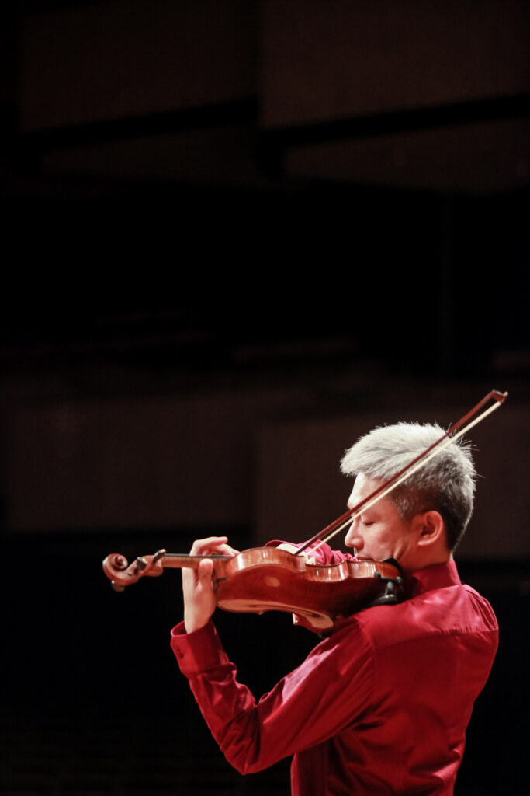

import { YouTube, LinkPreview } from "astro-embed";
import "@splidejs/splide/css";
import { Splide, SplideSlide } from "astro-splide";
import MdxImage from "@components/MdxImage/MdxImage.astro";
import MdxEmbed from "@components/MdxImage/MdxEmbed.astro";

**《弦挑。號角響》**

> 台北城市愛樂希望讓古典樂與你我的距離不再這麼遙遠，  
> 人人都能走進音樂廳聽一場我們為您安排的樂曲。  
> 舞臺上一群愛好音樂的學生以及陪伴成長的家長，從小手把手教導的專業  
> 老師們領著這些略顯生澀的學員團，或許音準差強人意、偶爾還是因  
> 緊張小出槌，但我們希望和臺下的家人朋友們，分享我們熱愛的音樂。

**曲目**

**翠綠雄鷹**  
Richard Meyer: "The Emerald Falcon"

**生日快樂變奏曲**  
Claus - Dieter Ludwig : "Happy Birthday"

**選自米堯《普羅旺斯組曲**》  
Darius Milhaud : Anime From"Suite Provencale" ,Op.152d

**布魯赫小提琴協奏曲**  
Max Bruch : Violin Concerto in g minor, Op. 26  
\- 小提琴獨奏**游山** \-

**威尼斯狂歡節變奏曲**  
Jean-Baptiste Arban : Variations on "The Carnival of Venice"  
\- 小號獨奏 **侯傳安** -

**拿坡里民謠變奏曲**  
Herman Bellstedt : Napoli -Camzone Napoletana con Variazioni

**帶我飛向月球**  
"Fly Me To The Moon"  
\- 編曲 **謝宇婷** \-

**威風凛凛進行曲**  
Edward Elgar : "Pomp and Circumstance" Op. 39, March No.1

**第二號舞曲**  
Arturo Marquez : Danzon No. 2

<Splide
class="not-content"
options={{
		// check for options at https://splidejs.com/guides/options/
		type: "loop", // type of the carousel
		autoplay: true, // activate autoplay
		interval: 2000, // autoplay interval in milliseconds
		pauseOnHover: false, // do not pause autoplay on mouseover
	}}

>

    <SplideSlide>
    	{" "}
    	<MdxImage src="/images/stringdance/IMG_1230-scaled.jpg" alt="" />{" "}
    </SplideSlide>
    <SplideSlide>
    	{" "}
    	<MdxImage src="/images/stringdance/IMG_1530-scaled.jpg" alt="" />{" "}
    </SplideSlide>
    <SplideSlide>
    	{" "}
    	<MdxImage src="/images/stringdance/IMG_1533-scaled.jpg" alt="" />{" "}
    </SplideSlide>
    <SplideSlide>
    	{" "}
    	<MdxImage src="/images/stringdance/IMG_1574-scaled.jpg" alt="" />{" "}
    </SplideSlide>
    <SplideSlide>
    	{" "}
    	<MdxImage src="/images/stringdance/IMG_1655-scaled.jpg" alt="" />{" "}
    </SplideSlide>
    <SplideSlide>
    	{" "}
    	<MdxImage src="/images/stringdance/IMG_1741-scaled.jpg" alt="" />{" "}
    </SplideSlide>
    <SplideSlide>
    	{" "}
    	<MdxImage src="/images/stringdance/IMG_1739-scaled.jpg" alt="" />{" "}
    </SplideSlide>
    <SplideSlide>
    	{" "}
    	<MdxImage src="/images/stringdance/IMG_1798-scaled.jpg" alt="" />{" "}
    </SplideSlide>
    <SplideSlide>
    	{" "}
    	<MdxImage src="/images/stringdance/P1290215-scaled.jpg" alt="" />{" "}
    </SplideSlide>
    <SplideSlide>
    	{" "}
    	<MdxImage src="/images/stringdance/IMG_7157-scaled.jpg" alt="" />{" "}
    </SplideSlide>
    <SplideSlide>
    	{" "}
    	<MdxImage src="/images/stringdance/IMG_6326-scaled.jpg" alt="" />{" "}
    </SplideSlide>

</Splide>

<YouTube id="https://www.youtube.com/watch?v=8Vt2KgRrynA" />

<MdxEmbed
src="/images/stringdance/2023stringdance.pdf"
type="application/pdf"
width="100%"
height="400"

> </MdxEmbed>
